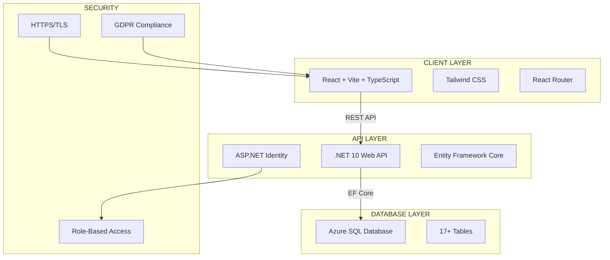

# Tech Stack Diagram (Mermaid)

Copy this into FigJam or any Mermaid-compatible tool.



## Simpler Version (for FigJam text)

```
┌─────────────────────────────────────────────────────────────┐
│                    NHYIRA HAVEN STACK                        │
├─────────────────────────────────────────────────────────────┤
│                                                             │
│   FRONTEND (Azure Static Web Apps)                         │
│   ┌─────────────────────────────────────────────────────┐  │
│   │  React  •  Vite  •  TypeScript  •  Tailwind CSS    │  │
│   └─────────────────────────────────────────────────────┘  │
│                          │                                  │
│                          │ HTTPS/TLS                        │
│                          ▼                                  │
│   BACKEND (Azure App Service)                              │
│   ┌─────────────────────────────────────────────────────┐  │
│   │  .NET 10 Web API  •  ASP.NET Identity              │  │
│   │  Entity Framework Core  •  Swagger                 │  │
│   └─────────────────────────────────────────────────────┘  │
│                          │                                  │
│                          │ SQL Connection                   │
│                          ▼                                  │
│   DATABASE (Azure SQL)                                     │
│   ┌─────────────────────────────────────────────────────┐  │
│   │  17+ Tables: residents, donors, cases, etc.        │  │
│   │  Seeded with CSV data                               │  │
│   └─────────────────────────────────────────────────────┘  │
│                                                             │
├─────────────────────────────────────────────────────────────┤
│   SECURITY                                                  │
│   • HTTPS/TLS (Azure-managed)                              │
│   • ASP.NET Identity (Admin, Staff, Donor roles)          │
│   • Azure Key Vault (secrets)                              │
│   • GDPR privacy policy + cookie consent                  │
│   • Content Security Policy headers                        │
└─────────────────────────────────────────────────────────────┘
```

## Class Requirements

| IS 401 | IS 413 | IS 414 | IS 455 |
|--------|--------|--------|--------|
| Scrum | .NET 10 + React | HTTPS/TLS | ML pipelines |
| Trello | CRUD operations | ASP.NET Identity | Donor churn |
| Burndown | Deployed to cloud | Role-based auth | Predictions |